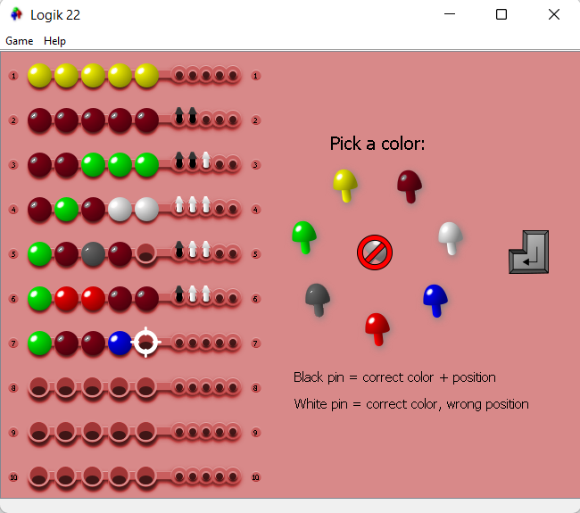

# Logik 22

Single player mastermind-like logical game.

## Rules
You search for a combination of colors. So you select 5 colors, then it
is evaluated - you get clues - black = correct color on correct position,
white = correct color on wrong position.

## Author
Author is JPEXS

## License
The game is licensed under GNU/GPL version 3, see [LICENSE](LICENSE) for details.
